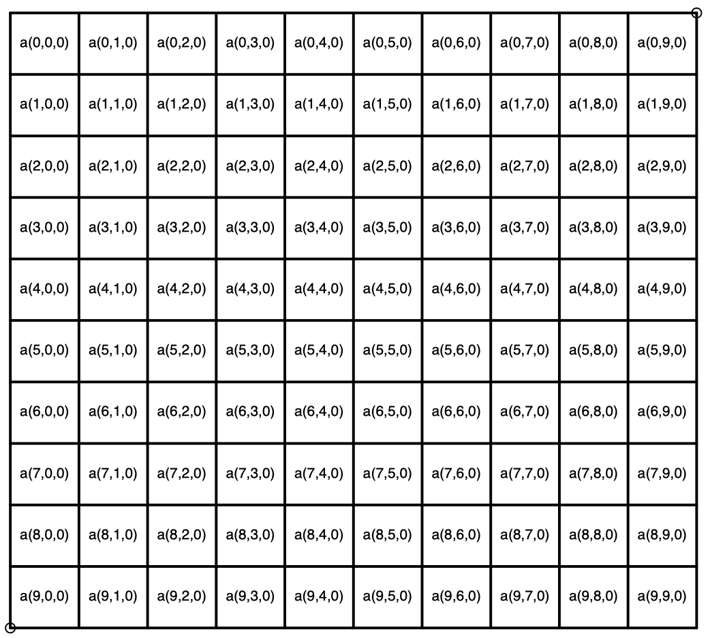

Estructuras de datos en el módulo numpy
=======================================

En el módulo ``numpy`` se tienen estructuras de datos de la siguiente forma:

**Vector fila**
 
.. image:: vector_fila.png

**Vector columna**

**Matriz**

**Volumen** Un volumen es representado por un prisma rectangular compuesto de tres dimensiones: largo, ancho y alto.
Esta representado por matrices apiladas del mismo tamaño.

