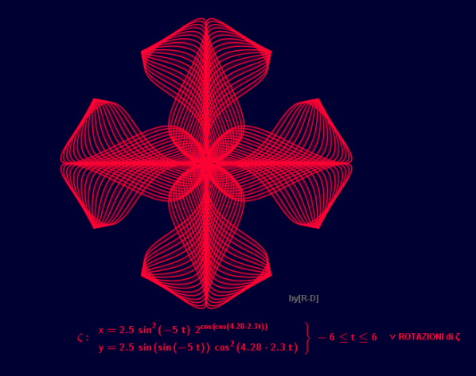
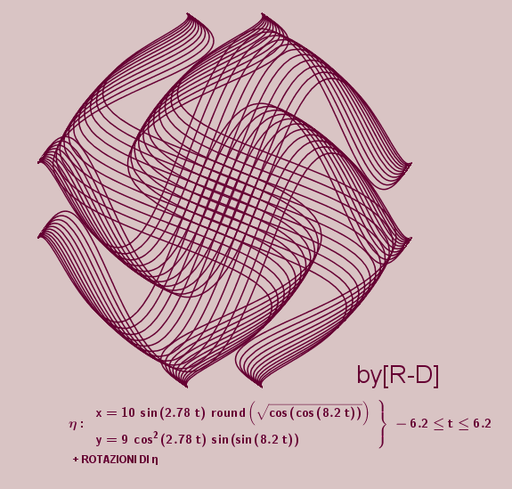
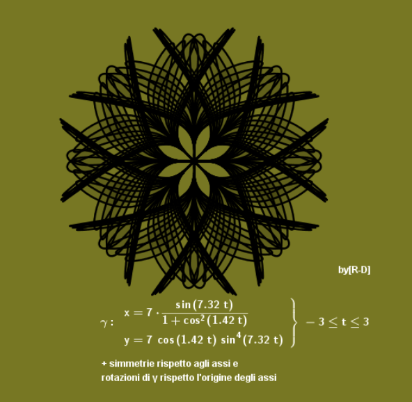
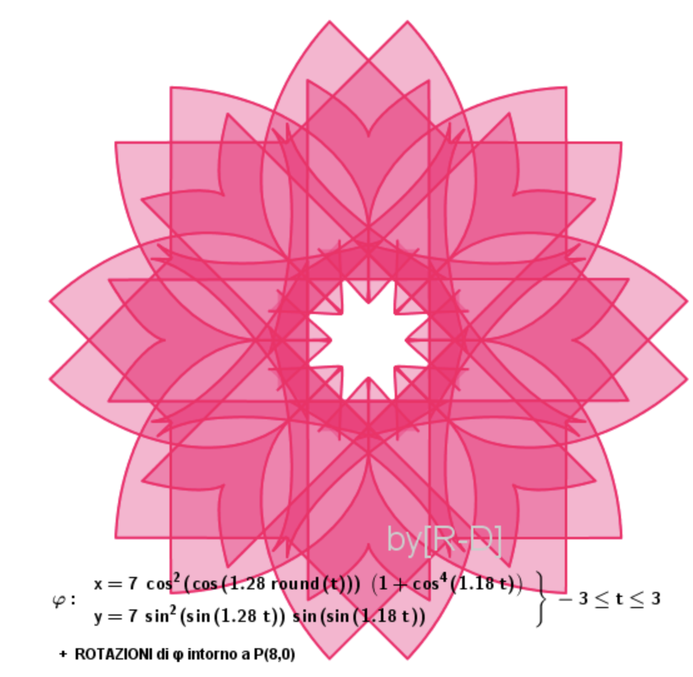
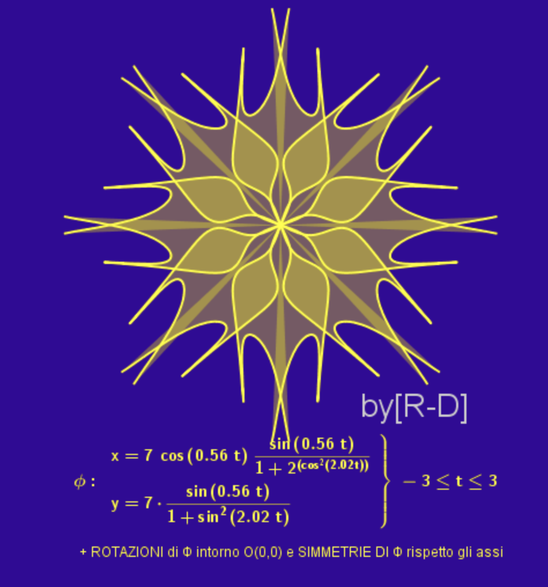

Tarea_oct0125
=============

Hacer las graficas de las siguientes figuras, y meter los programas en git antes de la próxima clase.

**Fig. A**

**Fig. B**

**Fig. C**

.. image:: i03.png

**Fig. D**

**Fig. E**

**Fig. F**

