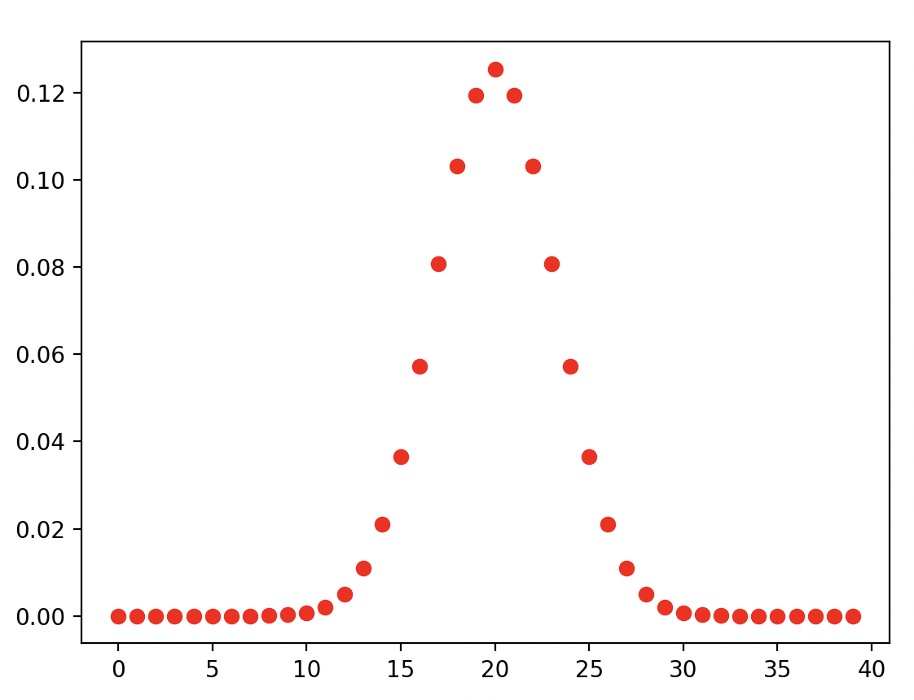

Distribución binomial
=====================

En teoría de la probabilidad y estadística, la distribución binomial o distribución binómica es una distribución de probabilidad discreta que 
cuenta el número de éxitos en una secuencia de :math:`n`
ensayos de Bernoulli independientes entre sí con una probabilidad fija 
:math:`p` de ocurrencia de éxito entre los ensayos. Un experimento de Bernoulli se caracteriza por ser dicotómico, esto es, solo dos 
resultados son posibles; a uno de estos se le denomina “éxito” y tiene una probabilidad de ocurrencia 
:math:`p`, y al otro se le denomina “fracaso” y tiene una probabilidad :math:`q=1-p`. 

Es posible entonces obtener la probabilidad de k éxitos en una repetición de n experimentos:

.. math::

   P(X = k) = \begin{pmatrix} n \\
   k \end{pmatrix} p^k (1-p)^{n-k}

.. code:: Python

   import math
   import numpy as np
   import matplotlib.pyplot as plt

   n = 40
   p = .5

   k = list(range(n))

   y = list()

   for i in k:
     com = math.factorial(n)*p**i*(1-p)**(n-i)/(math.factorial(i) * math.factorial(n-i))
     y.append(com)

   plt.plot(k, y, 'or')
   plt.show()

