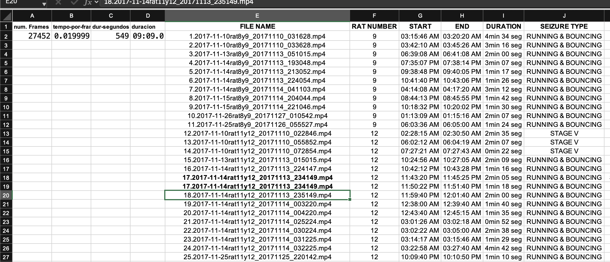

Módulo Pandas
=============

El tipo de dato estructurado que maneja el módule ``pandas`` es el tiene la forma de una  
**hoja de excel**

**Datos Ejemplo**

.. code:: Bash

   "nombres","x1","x2","x3","x4"
   "juan1",55.02,52.7,57.34,57.23
   "juan2",69.28,55.58,59.04,67.25
   "juan3",66.82,61.49,55.82,67.09
   "juan4",53.95,58.56,60.89,60.86
   "juan5",58.9,52.8,57.26,65.29
   "juan6",50.21,60.17,60.45,63.81
   "juan7",57.75,57.57,55.73,66.56
   "juan8",52.13,48.56,58.19,66.77
   "juan9",51.14,59.19,54.56,65.05
   "juan10",59.69,60.8,53.83,62.67
   "juan11",62.14,62.3,55.35,60.53
   "juan12",54.72,51.67,51.65,65.65
   "juan13",49.33,67.27,61.77,65.63
   "juan14",55.28,68.14,58.64,68.48
   "juan15",65.07,54.06,60.31,64.8
   "juan16",57.2,61.12,64.1,65.86
   "juan17",47.34,58.09,62.06,64.51
   "juan18",39.28,54.65,62.82,64.45
   "juan19",61.1,50.01,59.84,65.92
   "juan20",53.66,44.67,61.88,61

**Programa ejemplo**

.. code:: Python

   import matplotlib.pyplot as plt
   import pandas as pd

   dd = pd.read_csv("datos.csv")

   print(dd)

   print(dd.shape)

   nom = dd['nombres']

   print(nom)

   var = dd[['x1', 'x2']]

   print(var)

   print(type(var))

   print(var.mean())

   var.boxplot()

   #plt.show()

   var2 = dd.iloc[10:15, [1, 2]]

   print(var2)

